# Configuring VS Code for Remote Development

## Installing the Remote Development extension

* Choose the "Extensions" icon on the left sidebar in VS Code 

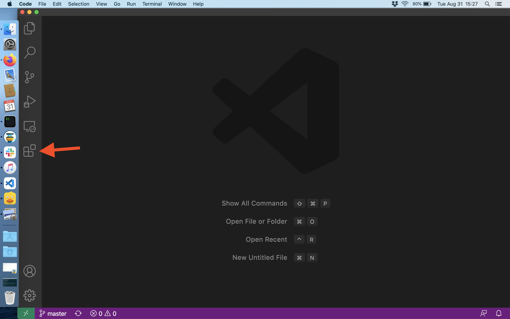

* Search for the "Remote Development" extension from Microsoft

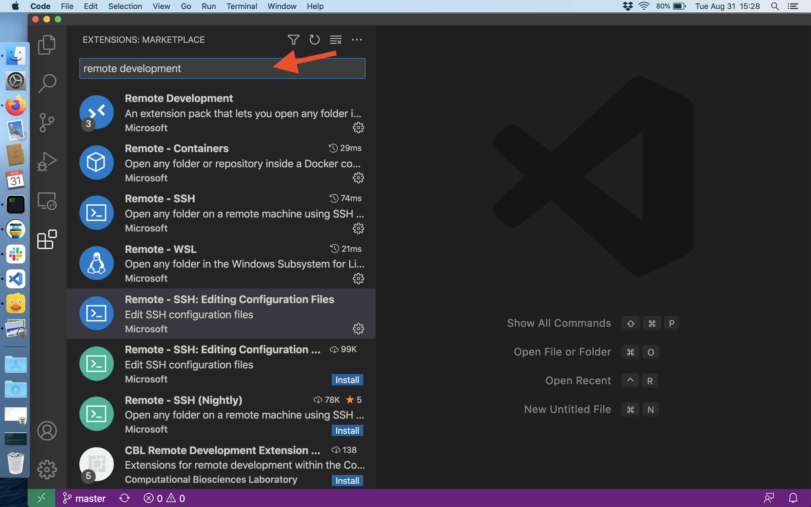

* Click the "Install" button on the extension information page to install

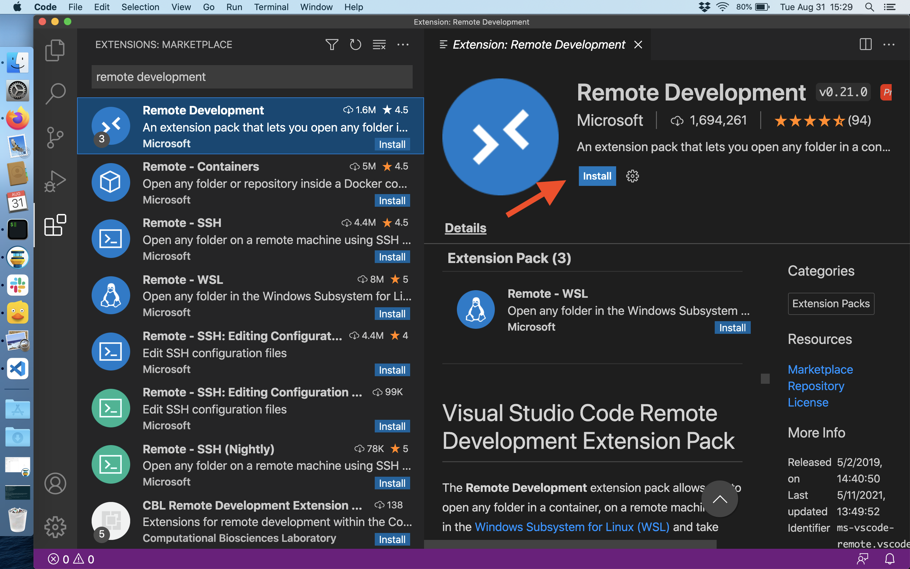

## Setting up a remote host

* In the "View" menu choose "Command Palette" 

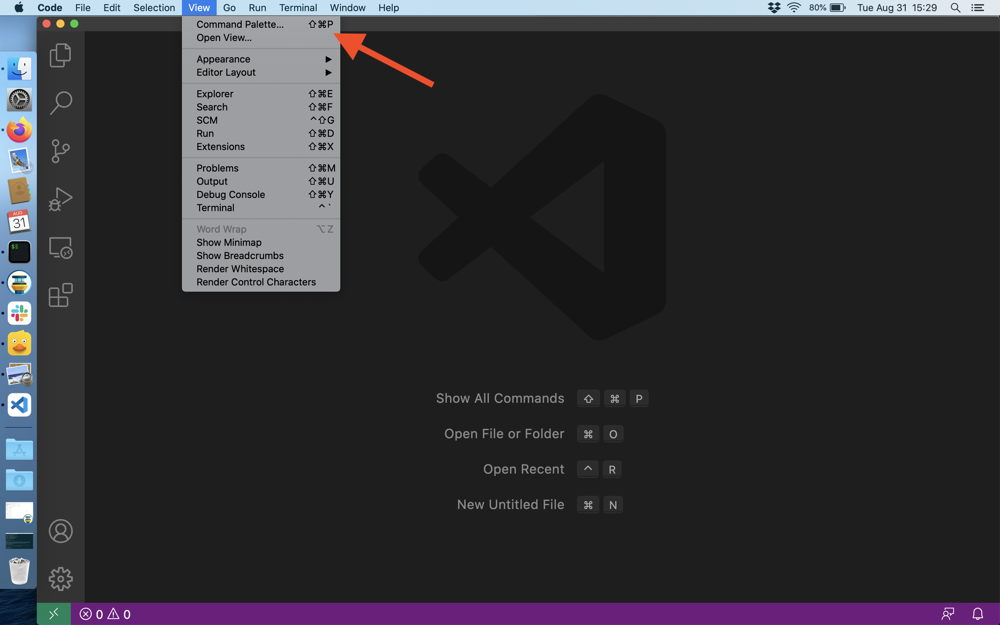

* Use the command palette search bar to search for "Remote-SSH: Add New SSH Host..."

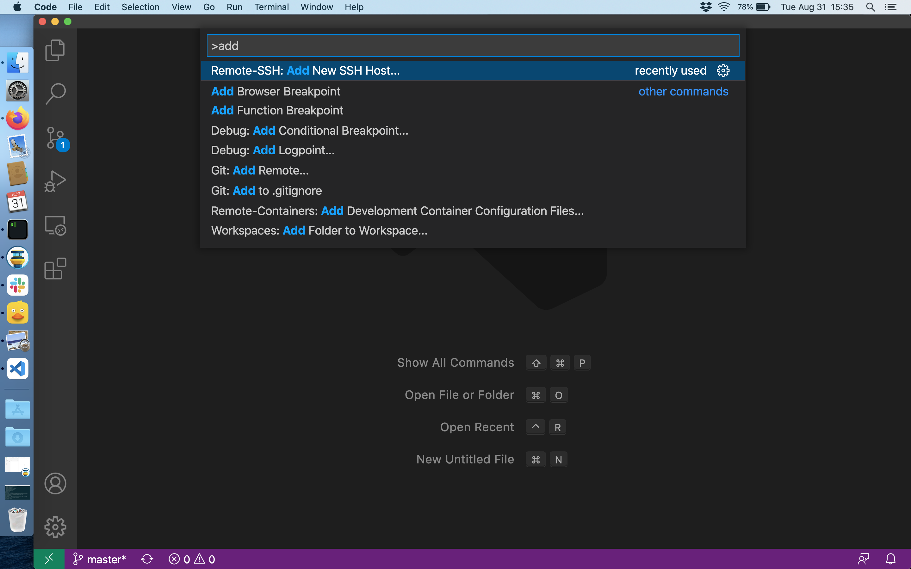

* Enter the info for your VM

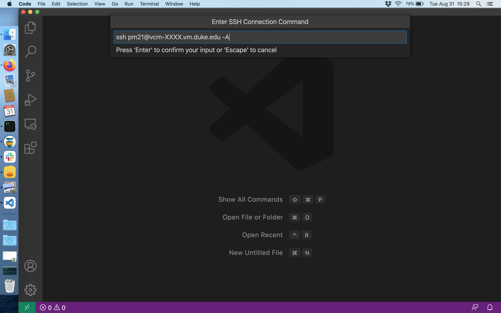

* Choose the default option (`/Users/username/.ssh/config`) for updating the SSH config file

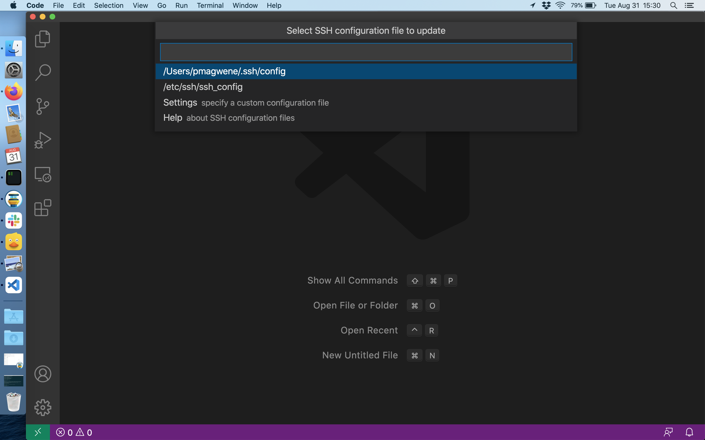

* After completing the above steps you should get a "Host Added" dialog as shown below. You can click the "Connect" button to start a connection to the host (see below)

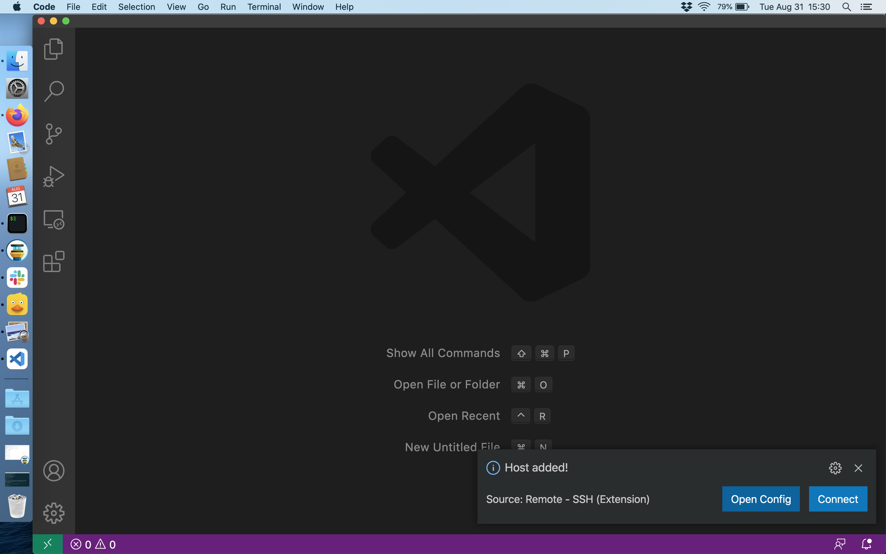

## Connecting to a host you've already created

* From the "View > Command Palette" menu search for "Remote-SSH: Connect to Host..."

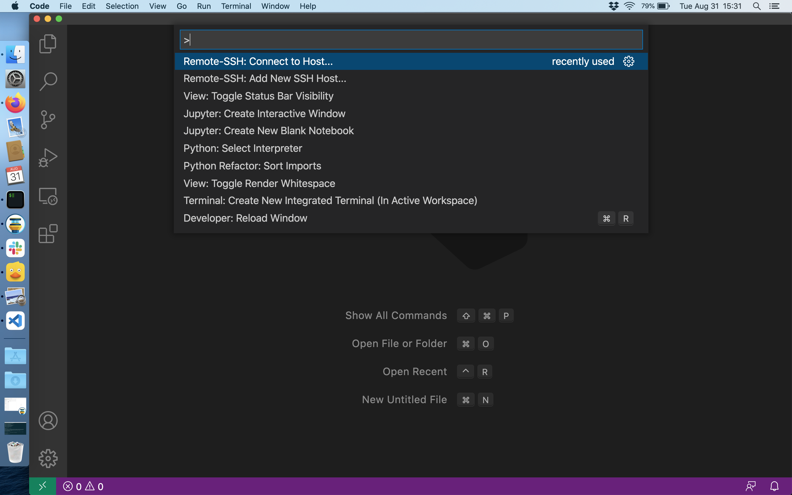

* The first time you login to your VM you will be prompted to choose the platform of the host. For the Duke hosted VMs the appropriate choice is "Linux"

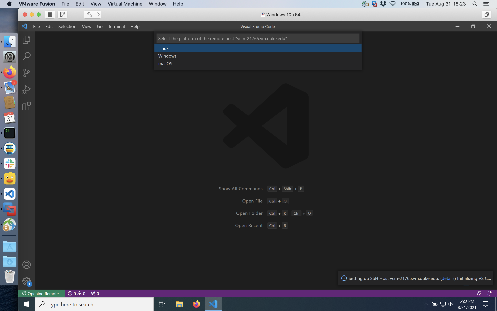

* The first time logging in you may also be prompted with the "fingerprint" of the host you're connecting to. This is another security measure and you should accept the default "Continue" option.  However, the host fingerprint should not change subsequently.

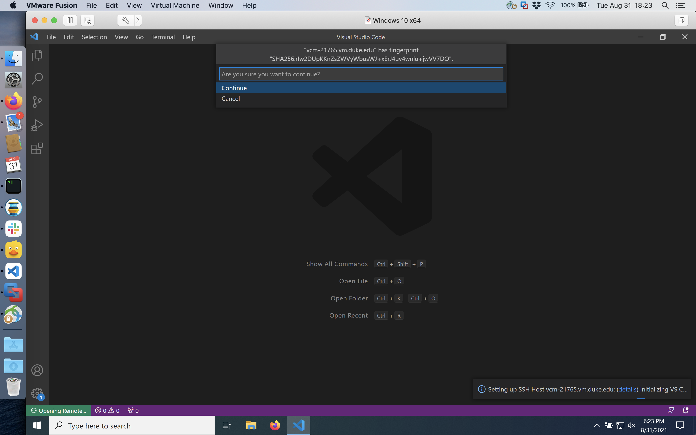

* To complete the connection to your VM you will be prompted to enter your password.  You should enter your NetID password here.

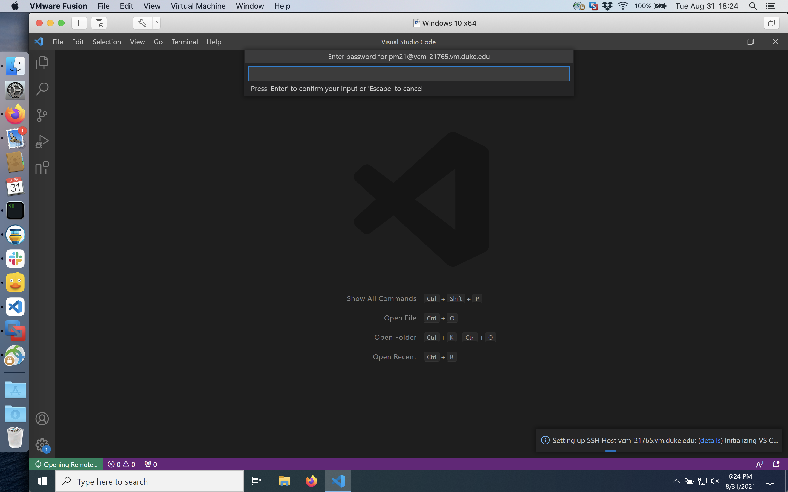

* Once you've successfully connected to the VM, VS Code will open a new Window.  You should "SSH: yourhostname" in a status bar at the bottom left of the window. You can also open a terminal from the "Terminal > New Terminal" menu item and execute standard unix commands (`ls`, `pwd`, etc.) to confirm you're properly connected.

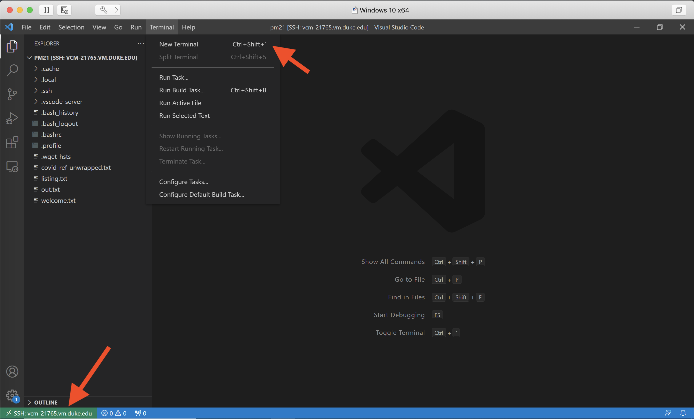

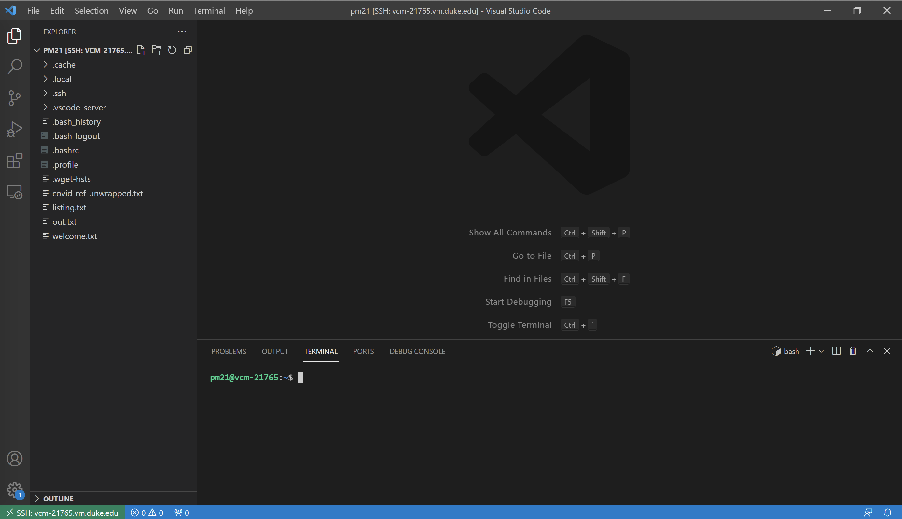
